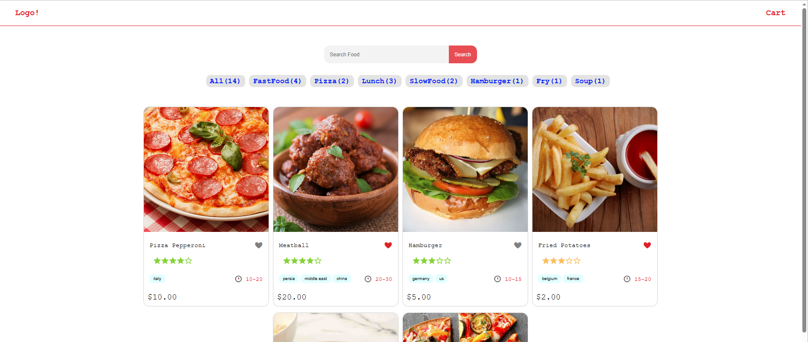

# Food

Food app enables quick food search, tagging-based filtering, and easy cart addition

## Table Of Contents 📖

- [Screenshots 🖼️](#screenshots-️)
- [Links 📌](#links-)
- [Your Process 📝](#tools-and-goal-)
  - [Built with 🛠️](#built-with-️)
  - [What you Learned 🗒️](#what-you-learned-️)

## Screenshots 🖼️

## Links 📌

Demo: **[Food](https://dejanv91.github.io/search-github-users)**

## Tools and goal 📝

### Built with 🛠️

#### Frameworks:

- JavaScript: **Angular**

#### Stack:

- Language: **HTML5**, **CSS3**, **TypeScript**

#### Package Manager:

- _npm_

### What you Learned 🗒️

I gained hands-on experience with Angular while developing this application.
I focused on building responsive user interfaces, managing components effectively, and handling data flow within the app.
